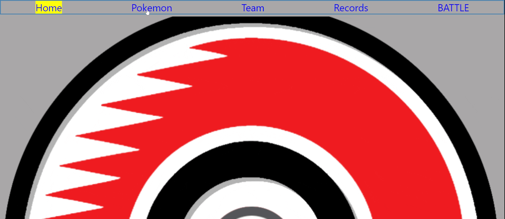

# Pokemon Fighter Simulation
### Welcome to the Pokemon Fighter Simulation.  This single page App allows you to create teams of pokemon and fight against randomly generated opponents, all while keeping track of your fight stats! If you'd rather just look, feel free to browse the pokemon list.

* From the home page, you can select pokemon, team, battle, or records.

* The pokemon page will display all original 151 pokemon.  The user can click on any icon to highlight that pokemon and view more details.

* The team page allows the user to create his/her own pokemon team!  Select a unique pokemon from each drop-down, decide on a team name, and then submit your creation.

* Submitting a team will load your team into the battle screen.  You can still select a previously created team if you'd prefer, or confirm your team selection to fight an enemy team.  The enemy team is random, so there's no telling who you'll be up against.

* Battle is simple.  Choose one of your team members, and then one of their attacks.  If your attack is super effective against the opponent's choice, you win!  However, if your attack is not very effective, you lose.  If the attack has a regular effect, it is a draw.

* The screen will refresh to allow for a new team selection and another battle.  Stats will be updated as you fight.  To view the records for all teams, click on the battle page.

## Demonstration

## Installation
react-router-dom v6
 

## Authors and Acknowledgement

The data used for this app all comes from https://pokeapi.co/, a free RESTful pokemon API created by Paul Hallett.

 